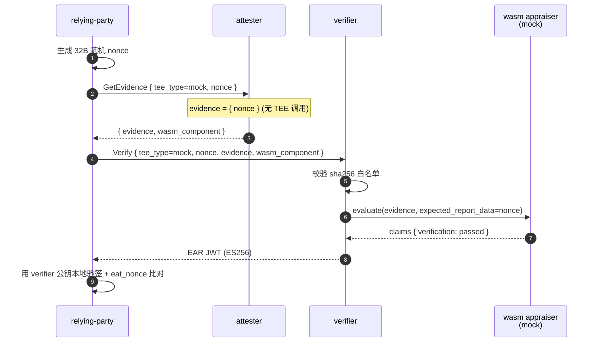
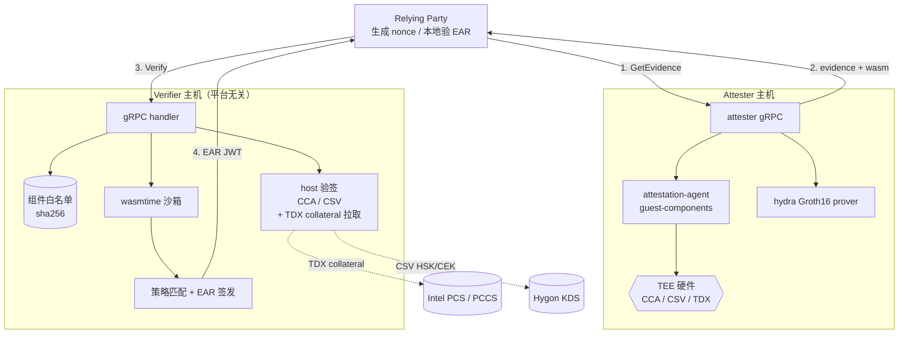

# unified-attestation

> 基于 wasm 验证组件 + Groth16 零知识证明的 self-verifying remote attestation 实现，verifier 与 TEE 平台解耦。

unified-attestation 解决远程证明中"verifier 必须为每种 TEE 内置专用代码"的耦合问题：把
TEE 平台特定的 evidence 验证逻辑封装成 wasm 组件，由 attester 随 evidence 一并上传；
verifier 仅做 sha256 白名单校验、wasmtime 沙箱调用、policy 比对、EAR 签发。
TEE 平台升级只需替换组件 + 更新白名单，verifier 二进制无需重发。

支持 mock / CCA / CSV / TDX 六条平台路径，每条路径均可叠加 hydra Groth16 证明，
在白名单中证明设备身份且不暴露具体索引。

## Table of Contents

- [Background](#background)
- [Install](#install)
- [Usage](#usage)
  - [mock 模式（无 TEE 依赖）](#mock-模式无-tee-依赖)
  - [TEE 路径](#tee-路径)
- [API](#api)
- [架构](#架构)
- [项目结构](#项目结构)
- [Maintainers](#maintainers)
- [Contributing](#contributing)
- [License](#license)

## Background

四条核心机制（详细论证见 [docs/design.md](docs/design.md)）：

- **verifier 与 TEE 平台解耦**：每种 TEE 的 evidence 验证逻辑封装到 wasm 组件，TEE 平台升级只需替换组件 + 更新 sha256 白名单
- **challenge 与 proof 密码学绑定**：challenge nonce 直接参与 Groth16 公开输入，proof 与 nonce 在密码学上耦合，重放攻击无窗口期
- **设备身份零知识证明**：用 Shrubs 累积器 + Merkle path 证明设备在白名单内，不暴露具体索引
- **三层独立信任锚**：组件白名单 + nonce 绑定 + 可信 root 列表，三层互不依赖
- **EAR 自包含**：EAR 是 ES256 JWT，签出后即可被任意持公钥的第三方独立校验，verifier 只是签发方

## Install

依赖：

- Rust 1.90.0（见 `rust-toolchain.toml`）
- `cargo install cargo-component --locked`（编 wasm appraiser 用）
- `rustup target add wasm32-wasip1`
- `openssl`（生成 ES256 密钥对）

构建：

```bash
# 1. 生成 EAR 签名密钥对到 config/keys/
bash scripts/gen-keys.sh

# 2. 编译所有 wasm appraiser
bash scripts/build-appraisers.sh

# 3. 编译 host 二进制
cargo build --release -p verifier -p attester -p relying-party
```

`config/keys/` 与 `config/hydra-shrubs/` 由脚本生成，已 gitignore。

## Usage

### mock 模式（无 TEE 依赖）

单机端到端冒烟，verifier / attester / relying-party 三方在本地走完整流程：

```bash
./scripts/run-mvp.sh
```

mock 路径不做真实硬件验签，仅打通 host ↔ wasm 链路。时序：



### TEE 路径

各 TEE 端到端步骤需对应硬件，命令清单与配置见各路径文档：

| 路径                | 文档                         | 硬件 / 依赖                          |
| ----------------- | -------------------------- | -------------------------------- |
| CCA / CCA + hydra | [docs/cca.md](docs/cca.md) | ARM CCA + guest-components AA    |
| CSV / CSV + hydra | [docs/csv.md](docs/csv.md) | Hygon CSV + AA + HSK/CEK 缓存或 KDS |
| TDX / TDX + hydra | [docs/tdx.md](docs/tdx.md) | Intel TDX + AA + PCS / PCCS 可达   |

支持的 `tee_type` 取值：`mock` / `cca` / `cca-hydra` / `csv` / `csv-hydra` / `tdx` / `tdx-hydra`。

## API

### gRPC 服务

| 服务                | 方法            | 调用方           | 说明                |
| ----------------- | ------------- | ------------- | ----------------- |
| `AttesterService` | `GetEvidence` | RP → attester | 推 nonce 收 evidence |
| `VerifierService` | `Verify`      | RP → verifier | 提交 evidence 拿 EAR  |

完整 message 字段定义在 `protos/attestation.proto`，调用流程与 EAR claims 见
[docs/protocol.md](docs/protocol.md)。

### 配置项

verifier / attester 全部 key 与默认值：[docs/config.md](docs/config.md)。

### hydra 子模块

Groth16 + shrubs whitelist 累积器的电路定义、public input 顺序、trusted setup 用法：
[docs/hydra.md](docs/hydra.md)。

## 架构



verifier 主机本身不解析 TEE evidence，所有平台特定逻辑封装在 wasm 组件。组件来源由 sha256 白名单约束，evidence 与 nonce 由 wasm 内部完成密码学绑定。

## 项目结构

```
unified-attestation/
├── protos/                      gRPC 服务与消息（attestation.proto, tonic-build）
├── verifier/                    平台无关 verifier host（含 wasmtime runtime + CCA/CSV host 验签）
├── attester/                    evidence 收集 + zk 证明 + wasm 组件携带
├── relying-party/               RP 客户端 + EAR JWT 校验
├── hydra/                       零知识证明子 crate（no_std，可交叉编译至 wasm32-wasip1）
├── appraisers/                  wasm 验证组件（cargo-component 编译）
│   ├── wit/verifier.wit         WIT 接口定义
│   ├── mock/                    skeleton appraiser
│   ├── cca/ + cca-hydra/        ARM CCA（host 真验签）+ hydra 叠加
│   ├── csv/ + csv-hydra/        Hygon CSV（host 真验签）+ hydra 叠加
│   └── tdx/ + tdx-hydra/        Intel TDX（wasm 内全链验签）+ hydra 叠加
├── config/                      配置模板
├── scripts/                     构建与一键脚本
└── docs/                        详细文档（按 TEE / 主题分册）
```

详细文档索引：

| 主题                                | 文档                                       |
| --------------------------------- | ---------------------------------------- |
| 设计要点（四条核心机制）                      | [docs/design.md](docs/design.md)         |
| 协议层（gRPC 服务、消息、EAR 格式）            | [docs/protocol.md](docs/protocol.md)     |
| 配置项参考（verifier / attester 全部 key） | [docs/config.md](docs/config.md)         |
| 操作手册（构建、脚本、工具命令）                  | [docs/operations.md](docs/operations.md) |
| CCA / CCA + hydra 路径              | [docs/cca.md](docs/cca.md)               |
| Hygon CSV / CSV + hydra 路径        | [docs/csv.md](docs/csv.md)               |
| TDX / TDX + hydra 路径              | [docs/tdx.md](docs/tdx.md)               |
| hydra 子模块（电路、shrubs、setup）        | [docs/hydra.md](docs/hydra.md)           |

## Maintainers

[@likozhang](https://github.com/likozhang)

## Contributing

欢迎 issue / PR。提交前请：

1. `cargo fmt --all` + `cargo clippy --workspace -- -D warnings`
2. 修改 wasm appraiser 后重跑 `bash scripts/build-appraisers.sh`，并把新的 sha256 同步到对应 `verifier-*.toml`
3. 修改 hydra 电路后需重新执行 `cargo run -p hydra --bin setup_keys` 与 `cargo run -p hydra --example shrubs_roots`，并更新 verifier policy 中的 `trusted_roots_hex`
4. 文档语言遵循项目约定（`.claude/rules/docs.md`）：尽量不用人称代词，描述配示例

本项目遵循 [Standard Readme](https://github.com/RichardLitt/standard-readme) 规范。

## License

未指定。
