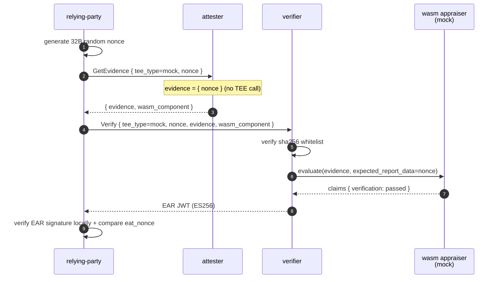
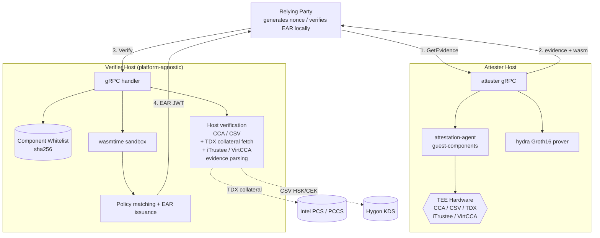

# unified-attestation

> A self-verifying remote attestation implementation based on wasm verification components + Groth16 zero-knowledge proofs, decoupling the verifier from TEE platforms.

unified-attestation addresses the coupling problem in remote attestation where "the verifier must embed platform-specific code for each TEE." Platform-specific evidence verification logic is encapsulated into wasm components and uploaded by the attester alongside evidence. The verifier only performs sha256 whitelist validation, wasmtime sandbox invocation, policy comparison, and EAR issuance. TEE platform upgrades only require replacing the component and updating the whitelist — the verifier binary needs no re-release.

Supports eight platform paths: mock / CCA / CSV / TDX / iTrustee / VirtCCA. Each path can optionally stack hydra Groth16 proofs to prove device identity within a whitelist without revealing the specific index.

## Table of Contents

- [Background](#background)
- [Install](#install)
- [Usage](#usage)
  - [Mock mode (no TEE dependency)](#mock-mode-no-tee-dependency)
  - [TEE paths](#tee-paths)
- [API](#api)
- [Architecture](#architecture)
- [Project Structure](#project-structure)

## Background

Four core mechanisms (detailed discussion in [docs/en/design.md](docs/en/design.md)):

- **Verifier decoupled from TEE platforms**: Each TEE's evidence verification logic is encapsulated into a wasm component. Platform upgrades only require component replacement + sha256 whitelist updates.
- **Challenge-proof cryptographic binding**: The challenge nonce directly participates in Groth16 public inputs. The proof and nonce are cryptographically coupled — replay attacks have no window.
- **Zero-knowledge device identity proofs**: Shrubs accumulator + Merkle path prove a device is in the whitelist without exposing the specific index.
- **Three independent trust anchors**: Component whitelist + nonce binding + trusted root list. The three layers are independent of each other.
- **EAR self-containment**: EAR is an ES256 JWT that can be independently verified by any third party holding the public key. The verifier is just the issuer.

## Install

Dependencies:

- Rust 1.90.0 (see `rust-toolchain.toml`)
- `cargo install cargo-component --locked` (for building wasm appraisers)
- `rustup target add wasm32-wasip1`
- `openssl` (for generating ES256 key pairs)
- CCA / CSV / TDX / iTrustee / VirtCCA evidence collection depends on [guest-components](https://github.com/SmartTree-zq1997/guest-components) (`attestation-agent` + `api-server-rest`)

Build:

```bash
# 1. Generate EAR signing key pair into config/keys/
bash scripts/gen-keys.sh

# 2. Build all wasm appraisers
bash scripts/build-appraisers.sh

# 3. Build host binaries
cargo build --release -p verifier -p attester -p relying-party
```

`config/keys/` and `config/hydra-shrubs/` are generated by scripts and gitignored.

## Usage

### Mock mode (no TEE dependency)

Single-machine end-to-end smoke test — verifier / attester / relying-party run the full flow locally:

```bash
./scripts/run-mvp.sh
```

The mock path does not perform real hardware verification; it only tests the host ↔ wasm pipeline.



### TEE paths

End-to-end steps for each TEE require corresponding hardware. Command references and configuration in per-path docs:

| Path                | Doc                                                               | Hardware / Dependency                                                          |
| ------------------- | ----------------------------------------------------------------- | ------------------------------------------------------------------------------ |
| CCA / CCA + hydra   | [docs/en/cca.md](docs/en/cca.md)                                   | ARM CCA + [guest-components](https://github.com/SmartTree-zq1997/guest-components) |
| CSV / CSV + hydra   | [docs/en/csv.md](docs/en/csv.md)                                   | Hygon CSV + AA + HSK/CEK cache or KDS                                          |
| TDX / TDX + hydra   | [docs/en/tdx.md](docs/en/tdx.md)                                   | Intel TDX + AA + PCS / PCCS reachable                                          |
| iTrustee            | [docs/en/itrustee.md](docs/en/itrustee.md)                           | iTrustee TEE + libteeverifier.so                                               |
| VirtCCA             | [docs/en/virtcca.md](docs/en/virtcca.md)                             | VirtCCA TEE + libvccaattestation.so                                            |

Supported `tee_type` values: `mock` / `cca` / `cca-hydra` / `csv` / `csv-hydra` / `tdx` / `tdx-hydra` / `itrustee` / `virtcca`.

## API

### gRPC Services

| Service            | Method        | Caller         | Description                        |
| ------------------ | ------------- | -------------- | ---------------------------------- |
| `AttesterService`  | `GetEvidence` | RP → attester  | Push nonce, receive evidence       |
| `VerifierService`  | `Verify`      | RP → verifier  | Submit evidence, receive EAR       |

Full message field definitions in `protos/attestation.proto`. Call flow and EAR claims: [docs/en/protocol.md](docs/en/protocol.md).

### Configuration

All verifier / attester keys and defaults: [docs/en/config.md](docs/en/config.md).

### hydra sub-module

Circuit definition, public input ordering, and trusted setup for Groth16 + shrubs whitelist accumulator: [docs/en/hydra.md](docs/en/hydra.md).

## Architecture



The verifier host does not parse TEE evidence internally; all platform-specific logic is encapsulated in wasm components. Component provenance is constrained by the sha256 whitelist, and evidence-nonce cryptographic binding is performed inside wasm.

## Project Structure

```
unified-attestation/
├── protos/                       gRPC services and messages (attestation.proto, tonic-build)
├── verifier/                     Platform-agnostic verifier host (wasmtime runtime + CCA/CSV host verification)
├── attester/                     Evidence collection + zk proofs + wasm component delivery
├── relying-party/                RP client + EAR JWT verification
├── hydra/                        ZKP sub-crate (no_std, cross-compilable to wasm32-wasip1)
├── appraisers/                   Wasm verification components (built with cargo-component)
│   ├── wit/verifier.wit          WIT interface definition
│   ├── mock/                     Skeleton appraiser
│   ├── cca/ + cca-hydra/         ARM CCA (host verification) + hydra stacking
│   ├── csv/ + csv-hydra/         Hygon CSV (host verification) + hydra stacking
│   ├── tdx/ + tdx-hydra/         Intel TDX (full-chain verification in wasm) + hydra stacking
│   ├── itrustee/                 iTrustee (nonce binding in wasm + TA metric passthrough)
│   └── virtcca/                  VirtCCA (nonce binding in wasm + token metadata passthrough)
├── config/                       Configuration templates
├── contracts/                    Solidity contracts (DeviceVCRecord)
├── scripts/                      Build and one-shot scripts
└── docs/                         Detailed documentation (by TEE / topic)
    ├── en/                       English documentation
    └── zh/                       Chinese documentation
```

Detailed documentation index:

| Topic                                                    | Doc                                                                |
| -------------------------------------------------------- | ------------------------------------------------------------------ |
| Design rationale (four core mechanisms)                  | [docs/en/design.md](docs/en/design.md)                             |
| Protocol layer (gRPC services, messages, EAR format)     | [docs/en/protocol.md](docs/en/protocol.md)                         |
| Configuration reference (all verifier / attester keys)   | [docs/en/config.md](docs/en/config.md)                             |
| Operations manual (build, scripts, tool commands)        | [docs/en/operations.md](docs/en/operations.md)                     |
| CCA / CCA + hydra path                                   | [docs/en/cca.md](docs/en/cca.md)                                   |
| Hygon CSV / CSV + hydra path                             | [docs/en/csv.md](docs/en/csv.md)                                   |
| TDX / TDX + hydra path                                   | [docs/en/tdx.md](docs/en/tdx.md)                                   |
| iTrustee path (claims, evidence schema, test steps)       | [docs/en/itrustee.md](docs/en/itrustee.md)                         |
| VirtCCA path (claims, evidence schema, test steps)        | [docs/en/virtcca.md](docs/en/virtcca.md)                           |
| hydra sub-module (circuit, shrubs, setup)                | [docs/en/hydra.md](docs/en/hydra.md)                               |
