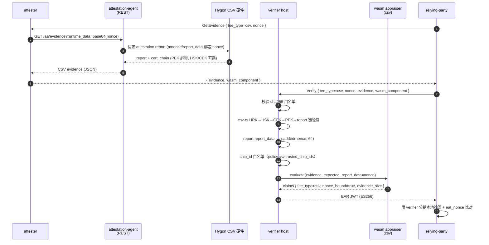
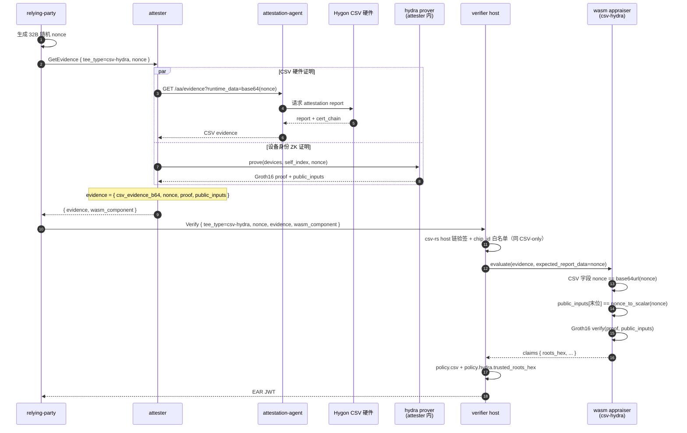

# Hygon CSV 路径

Hygon CSV 远程证明：硬件根签名 + nonce 绑定。CSV 真验签放在 verifier host 端
（csv-rs 走 openssl，不能跨 wasm32），wasm appraiser 仅做字段透传与 nonce 比对，
形态与 [CCA 路径](cca.md) 一致。

## 链与组件

```
HRK (Hygon Root Key, self-signed)
 └─ HSK (Hygon Signing Key)
     └─ CEK (Chip Endorsement Key)
         └─ PEK (Platform Endorsement Key)
             └─ TEE attestation report
```

- HRK：内嵌在 verifier 二进制（`verifier/assets/hygon_hrk.cert`），不可在线变更
- HSK / CEK：按 chip_id 维度发布，可离线缓存到 `<cert_dir>/hsk_cek/<chip_id>/hsk_cek.cert`，
  也可设 `policy.csv.allow_kds_fetch = true` 让 verifier 在线拉
  `https://cert.hygon.cn/hsk_cek?snumber=<chip_id>`
- PEK：随 attestation evidence 一并提交

## 时序图



## Evidence schema

```json
{
  "csv_evidence_b64": "<base64(Hygon CSV evidence JSON,含 attestation_report + cert_chain + serial_number)>",
  "nonce": "<base64url nonce>"
}
```

`csv_evidence` 内层结构由 guest-components AA 产出，主要字段：
`attestation_report`（V1/V2，包含 mnonce、report_data、measure 等）、
`cert_chain.pek`（必带）、`cert_chain.hsk_cek`（可选）、`serial_number`（chip_id）。

## 配置

verifier 侧 `[policy.csv]`：

| key | 含义 |
|---|---|
| `enabled` | 是否启用 host 端验签。false 时整体跳过（仅 demo） |
| `cert_dir` | HSK/CEK 离线缓存目录，默认 `/opt/hygon/csv` |
| `allow_kds_fetch` | 离线未命中时是否走 KDS 在线拉取 |
| `trusted_chip_ids` | chip_id 白名单（serial_number 文本）。空 → 不做白名单 |

attester 侧与 CCA 相同：`aa_endpoint` 指向 guest-components `api-server-rest`。

模板：`config/verifier-csv.toml` + `config/attester-csv.toml`。

## 端到端测试步骤

需要 Hygon CSV CPU + guest-components AA + HSK/CEK 缓存或 KDS 可达。

```bash
bash scripts/gen-keys.sh
bash scripts/build-appraisers.sh
cargo build --release -p verifier -p attester -p relying-party

ttrpc-aa &
api-server-rest --features attestation &

./target/release/verifier --config config/verifier-csv.toml > /tmp/verifier-csv.log 2>&1 &
./target/release/attester --config config/attester-csv.toml > /tmp/attester-csv.log 2>&1 &
sleep 2

./target/release/relying-party \
    --attester http://127.0.0.1:9000 \
    --verifier http://127.0.0.1:8080 \
    --tee-type csv \
    --pubkey config/keys/ear_public.pem \
    --ear-out /tmp/ear-csv.jwt
```

## 局限

- HRK 内嵌，Hygon 后续若轮换 root，需要重发 verifier 二进制
- AA 当前 CSV evidence 接口只覆盖 V1/V2 attestation report；V3 出现后需要同步升级 csv-rs
- 端到端冒烟需要真实 Hygon CSV CPU；本地仅能编译 + 静态白名单回归

## CSV + hydra 叠加

`tee_type = csv-hydra` 时，attester 同时携带 CSV evidence 与 Groth16 证明，
共用同一 nonce。校验顺序：

1. host 端 csv-rs 完整链验签 + chip_id 白名单（同 CSV-only）
2. wasm appraiser 内：
   - CSV 字段中的 `nonce == base64url(expected_report_data)`
   - hydra public_inputs 末位 == `nonce_to_scalar(expected_report_data)`
   - Groth16 verify

verifier 侧多一项 `[policy.hydra] trusted_roots_hex`，比对 wasm 返回的
`roots_hex` 是否逐项匹配。`trusted_roots_hex` 由
`cargo run -p hydra --example shrubs_roots` 计算。

模板：`config/verifier-csv-hydra.toml` + `config/attester-csv-hydra.toml`。



### 端到端测试步骤（csv-hydra）

在 CSV-only 步骤基础上多一步 hydra trusted setup，启动配置改为 `*-csv-hydra.toml`：

```bash
bash scripts/gen-keys.sh
bash scripts/build-appraisers.sh
cargo build --release -p verifier -p attester -p relying-party -p hydra

cargo run -p hydra --bin setup_keys --release -- 3 1 config/hydra-shrubs
cargo run -p hydra --example shrubs_roots --release

ttrpc-aa &
api-server-rest --features attestation &

./target/release/verifier --config config/verifier-csv-hydra.toml > /tmp/verifier-csv-hydra.log 2>&1 &
./target/release/attester --config config/attester-csv-hydra.toml > /tmp/attester-csv-hydra.log 2>&1 &
sleep 2

./target/release/relying-party \
    --attester http://127.0.0.1:9000 \
    --verifier http://127.0.0.1:8080 \
    --tee-type csv-hydra \
    --pubkey config/keys/ear_public.pem \
    --ear-out /tmp/ear-csv-hydra.jwt
```
