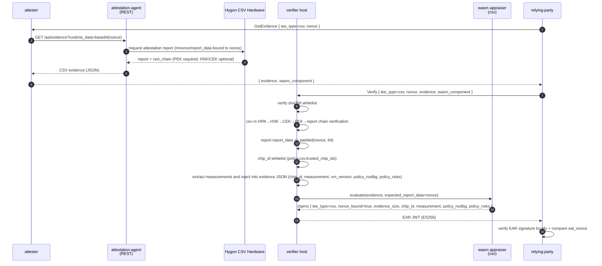
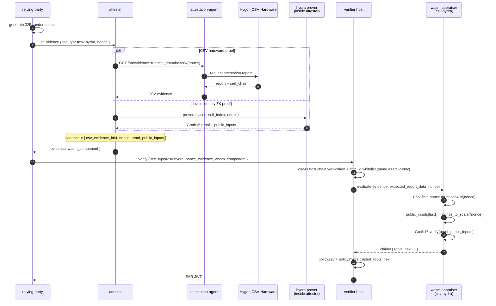

# Hygon CSV Path

Hygon CSV remote attestation: hardware root signature + nonce binding. CSV real verification runs on the verifier host (csv-rs uses OpenSSL, cannot cross-compile to wasm32). The wasm appraiser only does field passthrough and nonce comparison, following the same pattern as the [CCA path](cca.md).

## Certificate Chain

```
HRK (Hygon Root Key, self-signed)
 └─ HSK (Hygon Signing Key)
     └─ CEK (Chip Endorsement Key)
         └─ PEK (Platform Endorsement Key)
             └─ TEE attestation report
```

- HRK: embedded in the verifier binary (`verifier/assets/hygon_hrk.cert`), not changeable online
- HSK / CEK: published by chip_id dimension. Can be cached offline at `<cert_dir>/hsk_cek/<chip_id>/hsk_cek.cert` or fetched online via `policy.csv.allow_kds_fetch = true` from `https://cert.hygon.cn/hsk_cek?snumber=<chip_id>`
- PEK: submitted together with the attestation evidence

## Sequence Diagram



## Evidence Schema

```json
{
  "csv_evidence_b64": "<base64(Hygon CSV evidence JSON, containing attestation_report + cert_chain + serial_number)>",
  "nonce": "<base64url nonce>"
}
```

The inner structure of `csv_evidence` is produced by guest-components AA, with main fields: `attestation_report` (V1/V2, containing mnonce, report_data, measure, etc.), `cert_chain.pek` (required), `cert_chain.hsk_cek` (optional), `serial_number` (chip_id).

## Configuration

verifier-side `[policy.csv]`:

| key | description |
|---|---|
| `enabled` | Whether to enable host-side verification. When false, skip entirely (demo only) |
| `cert_dir` | HSK/CEK offline cache directory, default `/opt/hygon/csv` |
| `allow_kds_fetch` | Whether to fetch from KDS online on cache miss |
| `trusted_chip_ids` | chip_id whitelist (serial_number text). Empty = no whitelist |

attester-side is the same as CCA: `aa_endpoint` points to guest-components `api-server-rest`.

Templates: `config/verifier-csv.toml` + `config/attester-csv.toml`.

## End-to-End Test

Requires Hygon CSV CPU + guest-components AA + HSK/CEK cache or KDS reachable.

```bash
bash scripts/gen-keys.sh
bash scripts/build-appraisers.sh
cargo build --release -p verifier -p attester -p relying-party

ttrpc-aa &
api-server-rest --features attestation &

./target/release/verifier --config config/verifier-csv.toml > /tmp/verifier-csv.log 2>&1 &
./target/release/attester --config config/attester-csv.toml > /tmp/attester-csv.log 2>&1 &
sleep 2

./target/release/relying-party \
    --attester http://127.0.0.1:9000 \
    --verifier http://127.0.0.1:8080 \
    --tee-type csv \
    --pubkey config/keys/ear_public.pem \
    --ear-out /tmp/ear-csv.jwt
```

## Limitations

- HRK is embedded; if Hygon rotates the root, the verifier binary must be re-released
- AA currently only covers V1/V2 attestation reports for CSV evidence; V3 requires a synchronized csv-rs upgrade
- End-to-end smoke test requires a real Hygon CSV CPU; locally, only compilation + static whitelist regression is possible

## CSV + hydra Stacking

With `tee_type = csv-hydra`, the attester carries both CSV evidence and a Groth16 proof, sharing the same nonce. Verification order:

1. Host-side csv-rs full chain verification + chip_id whitelist (same as CSV-only)
2. Inside wasm appraiser:
   - CSV field `nonce == base64url(expected_report_data)`
   - hydra public_inputs last == `nonce_to_scalar(expected_report_data)`
   - Groth16 verify

The verifier adds `[policy.hydra] trusted_roots_hex` and compares. `trusted_roots_hex` is computed by `cargo run -p hydra --example shrubs_roots`.

Templates: `config/verifier-csv-hydra.toml` + `config/attester-csv-hydra.toml`.



### End-to-End Test (csv-hydra)

Based on CSV-only steps, add one hydra trusted setup step and change the startup configs to `*-csv-hydra.toml`:

```bash
bash scripts/gen-keys.sh
bash scripts/build-appraisers.sh
cargo build --release -p verifier -p attester -p relying-party -p hydra

cargo run -p hydra --bin setup_keys --release -- 3 1 config/hydra-shrubs
cargo run -p hydra --example shrubs_roots --release

ttrpc-aa &
api-server-rest --features attestation &

./target/release/verifier --config config/verifier-csv-hydra.toml > /tmp/verifier-csv-hydra.log 2>&1 &
./target/release/attester --config config/attester-csv-hydra.toml > /tmp/attester-csv-hydra.log 2>&1 &
sleep 2

./target/release/relying-party \
    --attester http://127.0.0.1:9000 \
    --verifier http://127.0.0.1:8080 \
    --tee-type csv-hydra \
    --pubkey config/keys/ear_public.pem \
    --ear-out /tmp/ear-csv-hydra.jwt
```
